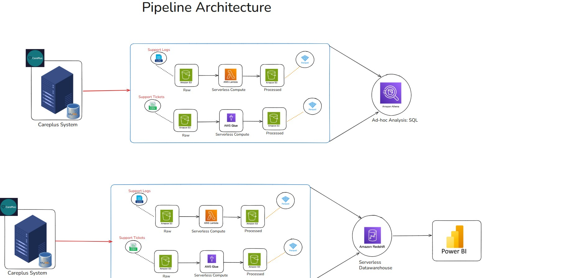
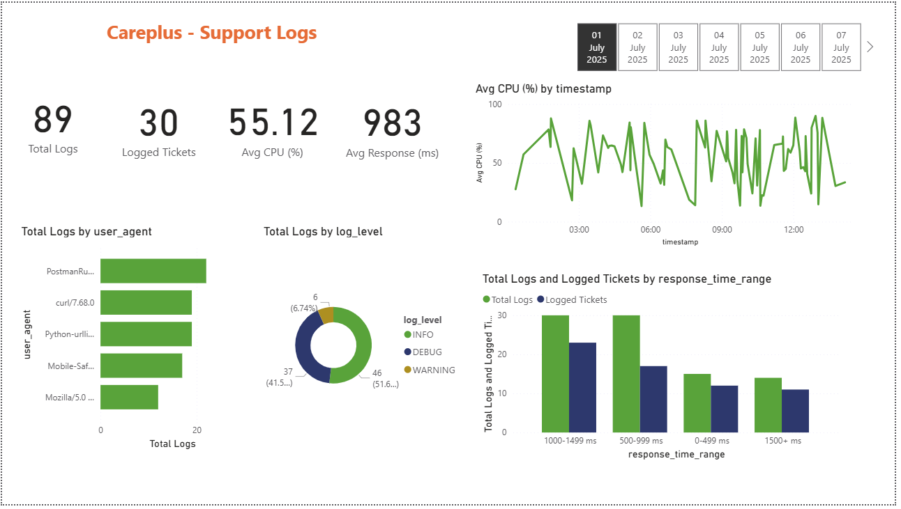
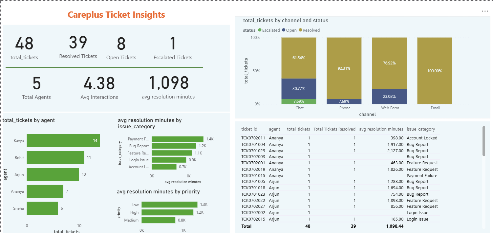

# Careplus-AWS-ETL-Data-Engineering-Project
An end-to-end, fully automated AWS ETL pipeline that moves CarePlus customer support data from OLTP sources into an analytics-ready data warehouse — with no manual steps once data lands in S3.
 
---
 
## Pipeline Architecture
 

 
CarePlus generates two data streams — support tickets from a MySQL database and system logs from a backend server. Both are ingested into Amazon S3, transformed into Parquet using serverless AWS services, and loaded into Amazon Redshift for reporting. Amazon Athena sits alongside Redshift for ad-hoc SQL directly over S3.
 
Every stage past ingestion is **event-driven**: an S3 event notification fires the next step automatically whenever a new file lands, with no external scheduler.
 
---
 
## Data Ingestion
 
Two Python notebooks extract data daily from source systems and land it untransformed into the S3 raw zone.
Both notebooks are **incremental**: each tracks the last successfully ingested date in a local tracker file and pulls only the next day's data on each run, avoiding full reloads.
 
---
 
## Data Transformation
 
Once a raw file lands in S3, an event notification triggers the transformation layer automatically. Each dataset has its own serverless processor:
 
**Support Logs → AWS Lambda**
- Parses each log entry from semi-structured text using regex
- Fixes `log_level` typos (`INF0` → `INFO`, `DEBG` → `DEBUG`, `warnING` → `WARNING`, `EROR` → `ERROR`)
- Drops rows with negative `response_time` and duplicate entries
- Casts types (`response_time` → int, `cpu` → float, `error` → bool, `timestamp` → datetime)
- Outputs Parquet to `support-logs/processed/`
**Support Tickets → AWS Glue**
- Reads raw CSV, casts all columns to correct types
- Renames `IssUeCat` → `issue_category`, drops null/empty fields
- Fixes `priority` typos (`Lw` → `Low`, `Medum` → `Medium`, `Hgh` → `High`)
- Filters out rows with negative `num_interactions`
- Outputs Snappy-compressed Parquet to `support-tickets/processed/`
Both pipelines run independently and are secured with dedicated, least-privilege IAM roles scoped per service.
 
---
 
## Data Warehousing & Analytics
 
**Amazon Athena** enables ad-hoc SQL querying directly over the processed Parquet files in S3 — no loading required.
 
**Amazon Redshift** is used for structured reporting. Once a processed Parquet file lands in S3, a dedicated Lambda function fires and runs a `COPY` command to load it into Redshift — one loader per dataset, both fully automated via S3 event triggers.

 
Redshift connects to **Power BI** for dashboard reporting on ticket resolution metrics and system log health.

---
 
## Key Learnings
 
- Designing a two-zone S3 data lake (raw/processed) to keep ingestion and transformation independently reprocessable
- Building fully event-driven pipelines using S3 notifications — no external scheduler needed
- Parsing semi-structured log text into a typed schema using regex in Lambda
- Writing incremental ingestion logic with a date-tracker pattern to avoid reprocessing full datasets
- Scoping IAM roles per service with least-privilege permissions rather than using one broad role
- Catching and fixing real-world data quality issues (typos, invalid values, duplicates) at the transformation layer before data reaches the warehouse

 
## Tech Stack
 
| Layer | Tools |
|---|---|
| Source | MySQL, log files |
| Ingestion | Python, pandas, boto3, SQLAlchemy |
| Storage | Amazon S3 |
| Transformation | AWS Lambda, AWS Glue (PySpark) |
| Ad-hoc Analytics | Amazon Athena |
| Data Warehouse | Amazon Redshift Serverless |
| Visualisation | Power BI |
| Security | AWS IAM (scoped per service) |
